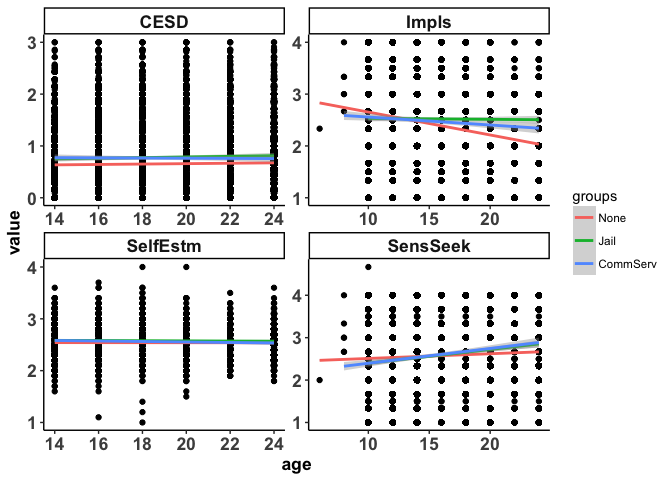

Assignment 1
================
Emorie D Beck
8/31/2017

-   [Workspace](#workspace)
    -   [Packages](#packages)
    -   [Working Directory](#working-directory)
    -   [Data](#data)
    -   [Question 1: Wide to Long to Wide](#question-1-wide-to-long-to-wide)
    -   [Question 2: Create Some Dates](#question-2-create-some-dates)
    -   [Question 3: Sample Size](#question-3-sample-size)
    -   [Question 4: Intraindividual Change](#question-4-intraindividual-change)
    -   [Question 6: Mean Level Change](#question-6-mean-level-change)
    -   [Question 7: Correlations Over Time](#question-7-correlations-over-time)

<style type="text/css">
.table {

    width: 40%;
    align: center;

}
</style>
Workspace
=========

Packages
--------

``` r
library(plyr)
library(tidyverse)
library(psych)
library(googlesheets)
library(lme4)
library(gridExtra)
library(stargazer)
library(stringr)
```

Working Directory
-----------------

``` r
data_path <- "https://github.com/longitudinal-data/1-descriptives-and-graphs-emoriebeck/raw/master"
```

Data
----

``` r
# load google sheet containing variable names, recoding, etc #
dat <- gs_title("NLSY79_ChildYA_MI_PSM")
```

    ## Sheet successfully identified: "NLSY79_ChildYA_MI_PSM"

``` r
# grab the child and mother data of variables chosen to include 
child <- dat %>% gs_read(ws = "Child") %>% filter(Include == "Yes")
```

    ## Accessing worksheet titled 'Child'.

    ## Parsed with column specification:
    ## cols(
    ##   RNUM = col_character(),
    ##   QName = col_character(),
    ##   Label = col_character(),
    ##   scrub = col_character(),
    ##   category = col_character(),
    ##   new_name = col_character(),
    ##   type = col_character(),
    ##   QText = col_character(),
    ##   year = col_character(),
    ##   comb_varname = col_character(),
    ##   Rule.Age = col_character(),
    ##   Rule.Item = col_character(),
    ##   Include = col_character(),
    ##   reverse_code = col_character(),
    ##   var.type = col_character(),
    ##   recode = col_character()
    ## )

``` r
# load in the Rdata files of the raw, uncleaned NLSY data sets
load(url(paste(data_path, "nlsy79cya.RData", sep = "/")))
# cut additional variables not included in the present analyses
new_data <- tbl_df(new_data) %>% select(one_of(child$RNUM))
```

Question 1: Wide to Long to Wide
--------------------------------

<strong>Move your data into a long format and a wide format. Did you have any specific challenges that you encountered? If so, discuss them. </strong>

First, we'll get the reference numbers of the dataset that make up the wide format columns. Then, we'll get the new names that I want to name the columns that make actual sense.

``` r
child_long_cols <- (child %>% filter(year != "XRND" & var.type == "predictor"))$RNUM
child_new_cols <-  (child %>% filter(year != "XRND" & var.type == "predictor"))$comb_varname
```

We have people with different dates of birth who were assessed at different times (every other year). So we choose to lump across two year age periods since no one was assessed twice in 2 years.

``` r
# create vector of original continuous age variables and new categorical ones
age_orig <- seq(8, 25, 1)
age_cat <- rep(seq(8,24,2), each = 2)
```

To rename columns, I'll first move it to long format because that will make it much easier to deal with weirdnesses in time later. I could also use `setNames()` to simply change the column names. I'm also going to filter out `NA` values, as those would otherwise cause issues for us later (e.g. calling `mean()` on participants with entirely missing data returns `NaN`). Then I'm going to add in some additonal info in order to reverse code some of the items (Child and YA surveys used differently keyed scales).

``` r
# take wide format data and shift time=varying variables to long format
# then rename the old reference numbers with new names
pred_long <- new_data %>%
  select(C0000100, C0000200, C0005700, C0005400, one_of(child_long_cols)) %>%
  gather(key = item, value = value, one_of(child_long_cols)) %>%
  filter(!is.na(value)) %>%
  setNames(c("PROC_CID", "PROC_MID", "Dem_DOBYear", "DemCSex", "item", "value")) %>% # rename columns
  mutate(item = mapvalues(item, child_long_cols, child_new_cols)) %>% # recode items to to new names
  left_join((child %>% 
               select(comb_varname, reverse_code) %>% # add in rules for 
               filter(comb_varname %in% child_new_cols) %>% # compositing and reverse coding
               rename(item = comb_varname)))
```

    ## Joining, by = "item"

``` r
head(pred_long)
```

    ## # A tibble: 6 x 7
    ##   PROC_CID PROC_MID Dem_DOBYear DemCSex              item value
    ##      <int>    <int>       <int>   <int>             <chr> <int>
    ## 1      801        8        1976       2 CESD_NoAppet.1994     1
    ## 2      802        8        1979       1 CESD_NoAppet.1994     0
    ## 3     5701       57        1979       1 CESD_NoAppet.1994     0
    ## 4     8601       86        1977       2 CESD_NoAppet.1994     3
    ## 5    18001      180        1978       1 CESD_NoAppet.1994     0
    ## 6    20801      208        1975       2 CESD_NoAppet.1994     0
    ## # ... with 1 more variables: reverse_code <chr>

Now I'm going to change it to wide format here because because I promise I can. But first, I have to take care of a couple of people who double filled out surveys (e.g. filled them out both in the child and young adult surveys).

``` r
# change to wide format beacuse I'm supposed to
pred_wide <- pred_long %>%
  group_by(PROC_CID, item) %>%
  summarise(value = mean(value, na.rm = T)) %>%
  spread(key = item, value = value)

head(pred_wide)
```

    ## # A tibble: 6 x 326
    ## # Groups:   PROC_CID [6]
    ##   PROC_CID CESD_AllEffort.1994 CESD_AllEffort.1996 CESD_AllEffort.1998
    ##      <int>               <dbl>               <dbl>               <dbl>
    ## 1      201                  NA                  NA                  NA
    ## 2      301                  NA                   2                   0
    ## 3      302                  NA                  NA                   3
    ## 4      303                  NA                  NA                  NA
    ## 5      401                  NA                   3                   0
    ## 6      801                   2                   2                  NA
    ## # ... with 322 more variables: CESD_AllEffort.2000 <dbl>,
    ## #   CESD_AllEffort.2002 <dbl>, CESD_AllEffort.2004 <dbl>,
    ## #   CESD_AllEffort.2006 <dbl>, CESD_AllEffort.2008 <dbl>,
    ## #   CESD_AllEffort.2010 <dbl>, CESD_AllEffort.2012 <dbl>,
    ## #   CESD_AllEffort.2014 <dbl>, CESD_Blues.2010 <dbl>,
    ## #   CESD_Blues.2012 <dbl>, CESD_Blues.2014 <dbl>,
    ## #   CESD_ConcProb.1994 <dbl>, CESD_ConcProb.1996 <dbl>,
    ## #   CESD_ConcProb.1998 <dbl>, CESD_ConcProb.2000 <dbl>,
    ## #   CESD_ConcProb.2002 <dbl>, CESD_ConcProb.2004 <dbl>,
    ## #   CESD_ConcProb.2006 <dbl>, CESD_ConcProb.2008 <dbl>,
    ## #   CESD_ConcProb.2010 <dbl>, CESD_ConcProb.2012 <dbl>,
    ## #   CESD_ConcProb.2014 <dbl>, CESD_Depressed.1994 <dbl>,
    ## #   CESD_Depressed.1996 <dbl>, CESD_Depressed.1998 <dbl>,
    ## #   CESD_Depressed.2000 <dbl>, CESD_Depressed.2002 <dbl>,
    ## #   CESD_Depressed.2004 <dbl>, CESD_Depressed.2006 <dbl>,
    ## #   CESD_Depressed.2008 <dbl>, CESD_Depressed.2010 <dbl>,
    ## #   CESD_Depressed.2012 <dbl>, CESD_Depressed.2014 <dbl>,
    ## #   CESD_Happy.2010 <dbl>, CESD_Happy.2012 <dbl>, CESD_Happy.2014 <dbl>,
    ## #   CESD_Lonely.2010 <dbl>, CESD_Lonely.2012 <dbl>,
    ## #   CESD_Lonely.2014 <dbl>, CESD_NoAppet.1994 <dbl>,
    ## #   CESD_NoAppet.1996 <dbl>, CESD_NoAppet.1998 <dbl>,
    ## #   CESD_NoAppet.2000 <dbl>, CESD_NoAppet.2002 <dbl>,
    ## #   CESD_NoAppet.2004 <dbl>, CESD_NoAppet.2006 <dbl>,
    ## #   CESD_NoAppet.2008 <dbl>, CESD_NoAppet.2010 <dbl>,
    ## #   CESD_NoAppet.2012 <dbl>, CESD_NoAppet.2014 <dbl>,
    ## #   CESD_NotGoing.1994 <dbl>, CESD_NotGoing.1996 <dbl>,
    ## #   CESD_NotGoing.1998 <dbl>, CESD_NotGoing.2000 <dbl>,
    ## #   CESD_NotGoing.2002 <dbl>, CESD_NotGoing.2004 <dbl>,
    ## #   CESD_NotGoing.2006 <dbl>, CESD_NotGoing.2008 <dbl>,
    ## #   CESD_NotGoing.2010 <dbl>, CESD_NotGoing.2012 <dbl>,
    ## #   CESD_NotGoing.2014 <dbl>, CESD_NotWorthLive.2010 <dbl>,
    ## #   CESD_NotWorthLive.2012 <dbl>, CESD_NotWorthLive.2014 <dbl>,
    ## #   CESD_Sad.1994 <dbl>, CESD_Sad.1996 <dbl>, CESD_Sad.1998 <dbl>,
    ## #   CESD_Sad.2002 <dbl>, CESD_Sad.2004 <dbl>, CESD_Sad.2006 <dbl>,
    ## #   CESD_Sad.2008 <dbl>, CESD_Sad.2010 <dbl>, CESD_Sad.2012 <dbl>,
    ## #   CESD_Sad.2014 <dbl>, CESD_SlpRestless.1994 <dbl>,
    ## #   CESD_SlpRestless.1996 <dbl>, CESD_SlpRestless.1998 <dbl>,
    ## #   CESD_SlpRestless.2000 <dbl>, CESD_SlpRestless.2002 <dbl>,
    ## #   CESD_SlpRestless.2004 <dbl>, CESD_SlpRestless.2006 <dbl>,
    ## #   CESD_SlpRestless.2008 <dbl>, CESD_SlpRestless.2010 <dbl>,
    ## #   CESD_SlpRestless.2012 <dbl>, CESD_SlpRestless.2014 <dbl>,
    ## #   Impls_chldPlanNoFun.1994 <dbl>, Impls_chldPlanNoFun.1996 <dbl>,
    ## #   Impls_chldPlanNoFun.1998 <dbl>, Impls_chldPlanNoFun.2000 <dbl>,
    ## #   Impls_chldPlanNoFun.2002 <dbl>, Impls_chldPlanNoFun.2004 <dbl>,
    ## #   Impls_chldPlanNoFun.2006 <dbl>, Impls_chldPlanNoFun.2008 <dbl>,
    ## #   Impls_chldPlanNoFun.2010 <dbl>, Impls_chldPlanNoFun.2012 <dbl>,
    ## #   Impls_chldPlanNoFun.2014 <dbl>, Impls_chldSelfControl.1994 <dbl>,
    ## #   Impls_chldSelfControl.1996 <dbl>, Impls_chldSelfControl.1998 <dbl>,
    ## #   Impls_chldSelfControl.2000 <dbl>, ...

Question 2: Create Some Dates
-----------------------------

<strong>Create a wave variable and date variable (if applicable). Take the date variable and convert it to a different date format such as time in study or age (if appropriate). What scale is most suitable for your analyses? (weeks/months/years?) </strong>
Below, I first split the long variable names into the variable names and the year. Then I'll use participants' dates of birth and the year of assessment to calculate their age at assessment. Everyone was assessed at different times (every even numbered year). So we choose to lump across two year age periods since no one was assessed twice in 2 years. In this case, age is the most appropriate scale because we are interested in developmental processes and some participants were infants while the others were reaching young adulthood. We will later use their dates of birth as a covariate to control for possible cohort effects. I'm also going to reverse code items here because we will need that for later.

``` r
# create vector of original continuous age variables and new categorical ones
age_orig <- seq(8, 25, 1)
age_cat <- rep(seq(8,24,2), each = 2)

pred_long <- pred_long %>%
  separate(item, c("item", "year"), sep = "[.]") %>%
  mutate(year = as.numeric(year), 
         age = ifelse(!is.na(value) & year >= Dem_DOBYear, year - Dem_DOBYear, NA)) %>%
  filter(!is.na(age) & !is.na(value) & age <= 25) %>%
  mutate(age = mapvalues(age, age_orig, age_cat)) %>%
  group_by(item) %>%
  # mutate(min = min(value, na.rm = T), max = max(value, na.rm = T),                  
  #        value = ifelse(reverse_code != "rev", value,
  #                       reverse.code(-1, value, mini = min[1], maxi = max[1]))) %>%
  # select(-min, -max) %>%
  ungroup()

head(pred_long)
```

    ## # A tibble: 6 x 9
    ##   PROC_CID PROC_MID Dem_DOBYear DemCSex         item  year value
    ##      <int>    <int>       <int>   <int>        <chr> <dbl> <int>
    ## 1      801        8        1976       2 CESD_NoAppet  1994     1
    ## 2      802        8        1979       1 CESD_NoAppet  1994     0
    ## 3     5701       57        1979       1 CESD_NoAppet  1994     0
    ## 4     8601       86        1977       2 CESD_NoAppet  1994     3
    ## 5    18001      180        1978       1 CESD_NoAppet  1994     0
    ## 6    20801      208        1975       2 CESD_NoAppet  1994     0
    ## # ... with 2 more variables: reverse_code <chr>, age <dbl>

Question 3: Sample Size
-----------------------

<strong>What is your sample size for each wave of assessment?</strong>

``` r
tab_fun <- function(df, Time){
  summ <- df %>% group_by(time_val) %>% summarize(N = n()) %>% 
    setNames(c(toupper(Time), "N"))
  knitr::kable(summ, caption = sprintf("Sample Size by %s", Time))
}

pred_size <- pred_long %>% 
  select(PROC_CID, age, year) %>%
  group_by(PROC_CID, year) %>%
  summarize(age = unique(age)[1]) %>%
  gather(key = time, value = time_val, age, year) %>%
  group_by(time) %>%
  nest() %>%
  mutate(tab = map2(data, time, tab_fun))

do.call("print", pred_size$tab)
```

|  AGE|     N|
|----:|-----:|
|    6|     1|
|    8|     6|
|   10|  3680|
|   12|  5345|
|   14|  6263|
|   16|  6121|
|   18|  5428|
|   20|  5240|
|   22|  4926|
|   24|  4193|

Question 4: Intraindividual Change
----------------------------------

<strong>Graph your data using the different time metrics, fitting individual curves for each person.</strong>

Before we do this, we first need to create some composites for our 4 DV's: Impulsivity, Sensation Seeking, CESD Depression, and Self-Esteem. To do this, we will take advantage of the item naming scheme, which is Category\_Item.Year. We've already taken care of the year by converting it to age, so now we'll (1) average across *items* and age (some participants filled out Child and YA surveys in the same year) then we'll (2) average across *categories* and age (to create composites).

``` r
pred_long <- pred_long %>%
  #unite(item, item, age, sep = ".") %>%
  group_by(PROC_CID, item, age) %>%
  summarize(value = mean(value, na.rm = T)) %>%
  ungroup() %>%
  separate(item, c("item", "type")) %>%
  group_by(PROC_CID, item, age) %>%
  summarize(value = mean(value, na.rm = T)) %>%
  ungroup() #%>%
  #mutate(age0 = age-14)

head(pred_long)
```

    ## # A tibble: 6 x 4
    ##   PROC_CID     item   age     value
    ##      <int>    <chr> <dbl>     <dbl>
    ## 1      201    Impls    10 2.3333333
    ## 2      201 SensSeek    10 2.3333333
    ## 3      301     CESD    14 1.7142857
    ## 4      301     CESD    16 0.8571429
    ## 5      301     CESD    20 0.0000000
    ## 6      301    Impls    12 3.0000000

Question 6: Mean Level Change
-----------------------------

<strong>Create an overall average trend of your data (split up into groups if appropriate). Attempt to color your individual data points and/or shade different lines (highlight some particiapnts, highlight the average trend line but not the individual level lines).</strong>

Here, I'm going to lazily add in grouping data to save time and effort (and you having to deal with more code).

``` r
load(url(paste(data_path, "groups.RData", sep = "/")))
pred_long %>%
  left_join(group_wide) %>%
  filter(!is.na(groups)) %>%
  ggplot(aes(x = age, y = value)) + 
  geom_point() +
  geom_smooth(method = "lm", aes(color = groups)) +
  facet_wrap(~item, ncol = 2, scale = "free") + 
  theme_classic() +
  theme(axis.text = element_text(face = "bold", size = rel(1.2)),
        axis.title = element_text(face = "bold", size = rel(1.2)),
        strip.text = element_text(face = "bold", size = rel(1.2)))
```

    ## Joining, by = "PROC_CID"



Question 7: Correlations Over Time
----------------------------------

<strong>Look at the correlations of your DV across time</strong>

``` r
r_fun <- function(df, Item){
  stargazer::stargazer(
    (df %>%
    spread(age, value) %>%
    select(-PROC_CID) %>%
    cor(., use = "pairwise")), 
    type = "html", summary = F,
    title = sprintf("Correlations of %s Over Ages", Item))
}

pred_cor <- pred_long %>%
  filter(!is.na(value)) %>%
  group_by(item) %>%
  nest() %>%
  mutate(r = map2(data, item, r_fun))
```

<table style="text-align:center">
<caption>
<strong>Correlations of Impls Over Ages</strong>
</caption>
<tr>
<td colspan="11" style="border-bottom: 1px solid black">
</td>
</tr>
<tr>
<td style="text-align:left">
</td>
<td>
6
</td>
<td>
8
</td>
<td>
10
</td>
<td>
12
</td>
<td>
14
</td>
<td>
16
</td>
<td>
18
</td>
<td>
20
</td>
<td>
22
</td>
<td>
24
</td>
</tr>
<tr>
<td colspan="11" style="border-bottom: 1px solid black">
</td>
</tr>
<tr>
<td style="text-align:left">
6
</td>
<td>
</td>
<td>
</td>
<td>
</td>
<td>
</td>
<td>
</td>
<td>
</td>
<td>
</td>
<td>
</td>
<td>
</td>
<td>
</td>
</tr>
<tr>
<td style="text-align:left">
8
</td>
<td>
</td>
<td>
1
</td>
<td>
-0.131
</td>
<td>
-0.189
</td>
<td>
-0.302
</td>
<td>
-0.161
</td>
<td>
</td>
<td>
-0.621
</td>
<td>
</td>
<td>
</td>
</tr>
<tr>
<td style="text-align:left">
10
</td>
<td>
</td>
<td>
-0.131
</td>
<td>
1
</td>
<td>
0.208
</td>
<td>
-0.018
</td>
<td>
-0.154
</td>
<td>
-0.138
</td>
<td>
-0.112
</td>
<td>
-0.082
</td>
<td>
-0.166
</td>
</tr>
<tr>
<td style="text-align:left">
12
</td>
<td>
</td>
<td>
-0.189
</td>
<td>
0.208
</td>
<td>
1
</td>
<td>
-0.008
</td>
<td>
-0.220
</td>
<td>
-0.204
</td>
<td>
-0.230
</td>
<td>
-0.167
</td>
<td>
-0.236
</td>
</tr>
<tr>
<td style="text-align:left">
14
</td>
<td>
</td>
<td>
-0.302
</td>
<td>
-0.018
</td>
<td>
-0.008
</td>
<td>
1
</td>
<td>
-0.066
</td>
<td>
0.075
</td>
<td>
0.042
</td>
<td>
0.080
</td>
<td>
0.034
</td>
</tr>
<tr>
<td style="text-align:left">
16
</td>
<td>
</td>
<td>
-0.161
</td>
<td>
-0.154
</td>
<td>
-0.220
</td>
<td>
-0.066
</td>
<td>
1
</td>
<td>
0.377
</td>
<td>
0.353
</td>
<td>
0.333
</td>
<td>
0.239
</td>
</tr>
<tr>
<td style="text-align:left">
18
</td>
<td>
</td>
<td>
</td>
<td>
-0.138
</td>
<td>
-0.204
</td>
<td>
0.075
</td>
<td>
0.377
</td>
<td>
1
</td>
<td>
0.438
</td>
<td>
0.379
</td>
<td>
0.335
</td>
</tr>
<tr>
<td style="text-align:left">
20
</td>
<td>
</td>
<td>
-0.621
</td>
<td>
-0.112
</td>
<td>
-0.230
</td>
<td>
0.042
</td>
<td>
0.353
</td>
<td>
0.438
</td>
<td>
1
</td>
<td>
0.410
</td>
<td>
0.470
</td>
</tr>
<tr>
<td style="text-align:left">
22
</td>
<td>
</td>
<td>
</td>
<td>
-0.082
</td>
<td>
-0.167
</td>
<td>
0.080
</td>
<td>
0.333
</td>
<td>
0.379
</td>
<td>
0.410
</td>
<td>
1
</td>
<td>
0.477
</td>
</tr>
<tr>
<td style="text-align:left">
24
</td>
<td>
</td>
<td>
</td>
<td>
-0.166
</td>
<td>
-0.236
</td>
<td>
0.034
</td>
<td>
0.239
</td>
<td>
0.335
</td>
<td>
0.470
</td>
<td>
0.477
</td>
<td>
1
</td>
</tr>
<tr>
<td colspan="11" style="border-bottom: 1px solid black">
</td>
</tr>
</table>
<table style="text-align:center">
<caption>
<strong>Correlations of SensSeek Over Ages</strong>
</caption>
<tr>
<td colspan="11" style="border-bottom: 1px solid black">
</td>
</tr>
<tr>
<td style="text-align:left">
</td>
<td>
6
</td>
<td>
8
</td>
<td>
10
</td>
<td>
12
</td>
<td>
14
</td>
<td>
16
</td>
<td>
18
</td>
<td>
20
</td>
<td>
22
</td>
<td>
24
</td>
</tr>
<tr>
<td colspan="11" style="border-bottom: 1px solid black">
</td>
</tr>
<tr>
<td style="text-align:left">
6
</td>
<td>
</td>
<td>
</td>
<td>
</td>
<td>
</td>
<td>
</td>
<td>
</td>
<td>
</td>
<td>
</td>
<td>
</td>
<td>
</td>
</tr>
<tr>
<td style="text-align:left">
8
</td>
<td>
</td>
<td>
1
</td>
<td>
0.018
</td>
<td>
</td>
<td>
-0.160
</td>
<td>
0.343
</td>
<td>
</td>
<td>
0.455
</td>
<td>
</td>
<td>
</td>
</tr>
<tr>
<td style="text-align:left">
10
</td>
<td>
</td>
<td>
0.018
</td>
<td>
1
</td>
<td>
0.282
</td>
<td>
-0.075
</td>
<td>
-0.193
</td>
<td>
-0.128
</td>
<td>
-0.123
</td>
<td>
-0.118
</td>
<td>
-0.124
</td>
</tr>
<tr>
<td style="text-align:left">
12
</td>
<td>
</td>
<td>
</td>
<td>
0.282
</td>
<td>
1
</td>
<td>
-0.002
</td>
<td>
-0.277
</td>
<td>
-0.260
</td>
<td>
-0.241
</td>
<td>
-0.201
</td>
<td>
-0.134
</td>
</tr>
<tr>
<td style="text-align:left">
14
</td>
<td>
</td>
<td>
-0.160
</td>
<td>
-0.075
</td>
<td>
-0.002
</td>
<td>
1
</td>
<td>
-0.178
</td>
<td>
-0.012
</td>
<td>
-0.042
</td>
<td>
0.005
</td>
<td>
-0.098
</td>
</tr>
<tr>
<td style="text-align:left">
16
</td>
<td>
</td>
<td>
0.343
</td>
<td>
-0.193
</td>
<td>
-0.277
</td>
<td>
-0.178
</td>
<td>
1
</td>
<td>
0.453
</td>
<td>
0.443
</td>
<td>
0.383
</td>
<td>
0.378
</td>
</tr>
<tr>
<td style="text-align:left">
18
</td>
<td>
</td>
<td>
</td>
<td>
-0.128
</td>
<td>
-0.260
</td>
<td>
-0.012
</td>
<td>
0.453
</td>
<td>
1
</td>
<td>
0.486
</td>
<td>
0.524
</td>
<td>
0.425
</td>
</tr>
<tr>
<td style="text-align:left">
20
</td>
<td>
</td>
<td>
0.455
</td>
<td>
-0.123
</td>
<td>
-0.241
</td>
<td>
-0.042
</td>
<td>
0.443
</td>
<td>
0.486
</td>
<td>
1
</td>
<td>
0.455
</td>
<td>
0.508
</td>
</tr>
<tr>
<td style="text-align:left">
22
</td>
<td>
</td>
<td>
</td>
<td>
-0.118
</td>
<td>
-0.201
</td>
<td>
0.005
</td>
<td>
0.383
</td>
<td>
0.524
</td>
<td>
0.455
</td>
<td>
1
</td>
<td>
0.625
</td>
</tr>
<tr>
<td style="text-align:left">
24
</td>
<td>
</td>
<td>
</td>
<td>
-0.124
</td>
<td>
-0.134
</td>
<td>
-0.098
</td>
<td>
0.378
</td>
<td>
0.425
</td>
<td>
0.508
</td>
<td>
0.625
</td>
<td>
1
</td>
</tr>
<tr>
<td colspan="11" style="border-bottom: 1px solid black">
</td>
</tr>
</table>
<table style="text-align:center">
<caption>
<strong>Correlations of CESD Over Ages</strong>
</caption>
<tr>
<td colspan="7" style="border-bottom: 1px solid black">
</td>
</tr>
<tr>
<td style="text-align:left">
</td>
<td>
14
</td>
<td>
16
</td>
<td>
18
</td>
<td>
20
</td>
<td>
22
</td>
<td>
24
</td>
</tr>
<tr>
<td colspan="7" style="border-bottom: 1px solid black">
</td>
</tr>
<tr>
<td style="text-align:left">
14
</td>
<td>
1
</td>
<td>
0.355
</td>
<td>
0.274
</td>
<td>
0.266
</td>
<td>
0.250
</td>
<td>
0.235
</td>
</tr>
<tr>
<td style="text-align:left">
16
</td>
<td>
0.355
</td>
<td>
1
</td>
<td>
0.364
</td>
<td>
0.308
</td>
<td>
0.282
</td>
<td>
0.255
</td>
</tr>
<tr>
<td style="text-align:left">
18
</td>
<td>
0.274
</td>
<td>
0.364
</td>
<td>
1
</td>
<td>
0.387
</td>
<td>
0.340
</td>
<td>
0.303
</td>
</tr>
<tr>
<td style="text-align:left">
20
</td>
<td>
0.266
</td>
<td>
0.308
</td>
<td>
0.387
</td>
<td>
1
</td>
<td>
0.394
</td>
<td>
0.388
</td>
</tr>
<tr>
<td style="text-align:left">
22
</td>
<td>
0.250
</td>
<td>
0.282
</td>
<td>
0.340
</td>
<td>
0.394
</td>
<td>
1
</td>
<td>
0.409
</td>
</tr>
<tr>
<td style="text-align:left">
24
</td>
<td>
0.235
</td>
<td>
0.255
</td>
<td>
0.303
</td>
<td>
0.388
</td>
<td>
0.409
</td>
<td>
1
</td>
</tr>
<tr>
<td colspan="7" style="border-bottom: 1px solid black">
</td>
</tr>
</table>
<table style="text-align:center">
<caption>
<strong>Correlations of SelfEstm Over Ages</strong>
</caption>
<tr>
<td colspan="7" style="border-bottom: 1px solid black">
</td>
</tr>
<tr>
<td style="text-align:left">
</td>
<td>
14
</td>
<td>
16
</td>
<td>
18
</td>
<td>
20
</td>
<td>
22
</td>
<td>
24
</td>
</tr>
<tr>
<td colspan="7" style="border-bottom: 1px solid black">
</td>
</tr>
<tr>
<td style="text-align:left">
14
</td>
<td>
1
</td>
<td>
0.190
</td>
<td>
0.100
</td>
<td>
0.149
</td>
<td>
0.141
</td>
<td>
0.141
</td>
</tr>
<tr>
<td style="text-align:left">
16
</td>
<td>
0.190
</td>
<td>
1
</td>
<td>
0.223
</td>
<td>
0.134
</td>
<td>
0.109
</td>
<td>
0.121
</td>
</tr>
<tr>
<td style="text-align:left">
18
</td>
<td>
0.100
</td>
<td>
0.223
</td>
<td>
1
</td>
<td>
0.267
</td>
<td>
0.185
</td>
<td>
0.155
</td>
</tr>
<tr>
<td style="text-align:left">
20
</td>
<td>
0.149
</td>
<td>
0.134
</td>
<td>
0.267
</td>
<td>
1
</td>
<td>
0.306
</td>
<td>
0.250
</td>
</tr>
<tr>
<td style="text-align:left">
22
</td>
<td>
0.141
</td>
<td>
0.109
</td>
<td>
0.185
</td>
<td>
0.306
</td>
<td>
1
</td>
<td>
0.298
</td>
</tr>
<tr>
<td style="text-align:left">
24
</td>
<td>
0.141
</td>
<td>
0.121
</td>
<td>
0.155
</td>
<td>
0.250
</td>
<td>
0.298
</td>
<td>
1
</td>
</tr>
<tr>
<td colspan="7" style="border-bottom: 1px solid black">
</td>
</tr>
</table>
